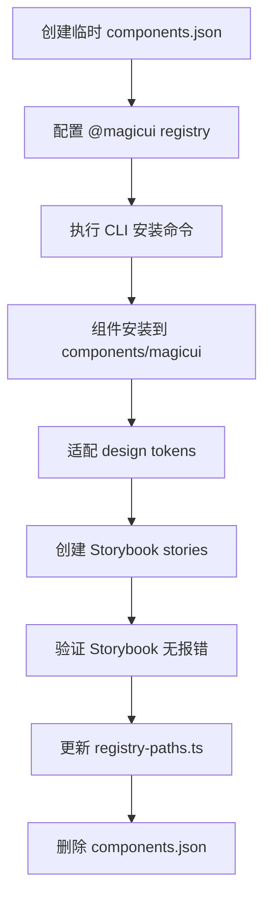

# 设计文档

## 概述

本设计文档描述如何通过 shadcn CLI 将 Magic UI 组件库集成到 design-system 项目中。核心原则是：所有组件代码必须通过 CLI 命令引入，不允许手动编写；集成完成后需验证 Storybook 正常运行，最后删除临时配置文件。

## 架构

### 整体流程



### 目录结构

```
apps/web/
├── components/
│   ├── magic/           # 现有自定义 magic 组件（如 spotlight.tsx）
│   ├── magicui/         # 通过 CLI 引入的 Magic UI 组件
│   │   ├── text-reveal.tsx
│   │   ├── typing-animation.tsx
│   │   ├── dock.tsx
│   │   ├── marquee.tsx
│   │   └── ...
│   ├── ui/              # 基础 UI 组件
│   └── blocks/          # 复合组件块
├── components.json      # 临时配置文件（安装完成后删除）
└── lib/
    └── utils.ts         # cn() 工具函数
```

## 组件和接口

### components.json 配置结构

```json
{
  "$schema": "https://ui.shadcn.com/schema.json",
  "style": "default",
  "rsc": false,
  "tsx": true,
  "tailwind": {
    "config": "tailwind.config.js",
    "css": "styles/globals.css",
    "baseColor": "slate",
    "cssVariables": true
  },
  "aliases": {
    "components": "@/components",
    "utils": "@/lib/utils",
    "ui": "@/components/ui",
    "lib": "@/lib",
    "hooks": "@/hooks"
  },
  "registries": {
    "@magicui": "https://magicui.design/r/{name}.json"
  }
}
```

### CLI 安装命令格式

```bash
# 在 apps/web 目录下执行
pnpm dlx shadcn@latest add @magicui/<component-name>
```

### 计划引入的组件列表

#### 文字动画组件 (Text Animations)

| 组件名称 | CLI 命令 |
|----------|----------|
| Text Reveal | `pnpm dlx shadcn@latest add @magicui/text-reveal` |
| Typing Animation | `pnpm dlx shadcn@latest add @magicui/typing-animation` |
| Word Rotate | `pnpm dlx shadcn@latest add @magicui/word-rotate` |
| Hyper Text | `pnpm dlx shadcn@latest add @magicui/hyper-text` |
| Text Animate | `pnpm dlx shadcn@latest add @magicui/text-animate` |
| Number Ticker | `pnpm dlx shadcn@latest add @magicui/number-ticker` |
| Animated Shiny Text | `pnpm dlx shadcn@latest add @magicui/animated-shiny-text` |
| Animated Gradient Text | `pnpm dlx shadcn@latest add @magicui/animated-gradient-text` |
| Blur Fade | `pnpm dlx shadcn@latest add @magicui/blur-fade` |

#### 按钮组件 (Buttons)

| 组件名称 | CLI 命令 |
|----------|----------|
| Shimmer Button | `pnpm dlx shadcn@latest add @magicui/shimmer-button` |
| Pulsating Button | `pnpm dlx shadcn@latest add @magicui/pulsating-button` |
| Rainbow Button | `pnpm dlx shadcn@latest add @magicui/rainbow-button` |
| Ripple Button | `pnpm dlx shadcn@latest add @magicui/ripple-button` |
| Interactive Hover Button | `pnpm dlx shadcn@latest add @magicui/interactive-hover-button` |

#### 背景效果组件 (Backgrounds)

| 组件名称 | CLI 命令 |
|----------|----------|
| Dot Pattern | `pnpm dlx shadcn@latest add @magicui/dot-pattern` |
| Grid Pattern | `pnpm dlx shadcn@latest add @magicui/grid-pattern` |
| Particles | `pnpm dlx shadcn@latest add @magicui/particles` |
| Ripple | `pnpm dlx shadcn@latest add @magicui/ripple` |
| Meteors | `pnpm dlx shadcn@latest add @magicui/meteors` |

#### 布局组件 (Layout)

| 组件名称 | CLI 命令 |
|----------|----------|
| Bento Grid | `pnpm dlx shadcn@latest add @magicui/bento-grid` |
| Marquee | `pnpm dlx shadcn@latest add @magicui/marquee` |
| Dock | `pnpm dlx shadcn@latest add @magicui/dock` |
| Terminal | `pnpm dlx shadcn@latest add @magicui/terminal` |

#### 特效组件 (Effects)

| 组件名称 | CLI 命令 |
|----------|----------|
| Border Beam | `pnpm dlx shadcn@latest add @magicui/border-beam` |
| Magic Card | `pnpm dlx shadcn@latest add @magicui/magic-card` |
| Shine Border | `pnpm dlx shadcn@latest add @magicui/shine-border` |
| Animated Beam | `pnpm dlx shadcn@latest add @magicui/animated-beam` |
| Animated List | `pnpm dlx shadcn@latest add @magicui/animated-list` |
| Confetti | `pnpm dlx shadcn@latest add @magicui/confetti` |
| Cool Mode | `pnpm dlx shadcn@latest add @magicui/cool-mode` |
| Sparkles Text | `pnpm dlx shadcn@latest add @magicui/sparkles-text` |

#### 社交/媒体组件 (Social/Media)

| 组件名称 | CLI 命令 |
|----------|----------|
| Globe | `pnpm dlx shadcn@latest add @magicui/globe` |
| Tweet Card | `pnpm dlx shadcn@latest add @magicui/tweet-card` |
| Hero Video Dialog | `pnpm dlx shadcn@latest add @magicui/hero-video-dialog` |
| Avatar Circles | `pnpm dlx shadcn@latest add @magicui/avatar-circles` |
| Orbiting Circles | `pnpm dlx shadcn@latest add @magicui/orbiting-circles` |
| Icon Cloud | `pnpm dlx shadcn@latest add @magicui/icon-cloud` |

#### 工具组件 (Utilities)

| 组件名称 | CLI 命令 |
|----------|----------|
| File Tree | `pnpm dlx shadcn@latest add @magicui/file-tree` |
| Code Comparison | `pnpm dlx shadcn@latest add @magicui/code-comparison` |
| Script Copy Button | `pnpm dlx shadcn@latest add @magicui/script-copy-btn` |
| Scroll Progress | `pnpm dlx shadcn@latest add @magicui/scroll-progress` |
| Animated Circular Progress Bar | `pnpm dlx shadcn@latest add @magicui/animated-circular-progress-bar` |
| Lens | `pnpm dlx shadcn@latest add @magicui/lens` |
| Pointer | `pnpm dlx shadcn@latest add @magicui/pointer` |

## 数据模型

### Storybook Story 结构

每个引入的组件需要创建对应的 story 文件：

```typescript
// apps/web/components/magicui/<component>.stories.tsx
import type { Meta, StoryObj } from "@storybook/react";
import { ComponentName } from "./<component>";

const meta: Meta<typeof ComponentName> = {
  title: "Magic UI/<ComponentName>",
  component: ComponentName,
  parameters: {
    layout: "centered",
  },
  tags: ["autodocs"],
};

export default meta;
type Story = StoryObj<typeof ComponentName>;

export const Default: Story = {
  args: {
    // 默认参数
  },
};
```

### registry-paths.ts 更新

```typescript
const COMPONENT_ROOTS = ["ui", "magic", "magicui", "blocks"] as const;
```


## 正确性属性

*正确性属性是指在系统所有有效执行中都应保持为真的特征或行为——本质上是关于系统应该做什么的形式化陈述。属性作为人类可读规范和机器可验证正确性保证之间的桥梁。*

### Property 1: 组件代码规范性

*For any* Magic UI 组件文件，该文件应当：
- 从 `@/lib/utils` 导入 `cn` 函数
- 使用 CSS 变量（如 `hsl(var(--primary))`）而非硬编码颜色值

**Validates: Requirements 2.4, 3.1, 3.2**

### Property 2: Registry 输出完整性

*For any* 通过 CLI 引入的 Magic UI 组件，执行 `build:registry` 后生成的 registry JSON 文件应当包含该组件的：
- 组件名称
- 文件路径
- 依赖信息

**Validates: Requirements 4.2, 4.3**

### Property 3: Storybook Story 存在性

*For any* 引入的 Magic UI 组件，应当存在对应的 `.stories.tsx` 文件，且该文件应当：
- 位于 `apps/web/components/magicui/` 目录
- 导出至少一个 Story

**Validates: Requirements 5.1**

### Property 4: 清理后系统完整性

*For any* 系统状态，在删除 `components.json` 后：
- 所有已安装的 Magic UI 组件应当可以正常导入
- Storybook 构建应当成功完成
- Registry 构建应当成功完成

**Validates: Requirements 7.1, 7.2, 7.3**

## 错误处理

### CLI 安装失败

| 错误场景 | 处理方式 |
|----------|----------|
| 网络连接失败 | 重试命令，检查网络连接 |
| 组件不存在 | 检查组件名称拼写，查阅 Magic UI 文档 |
| 依赖冲突 | 检查 package.json，手动解决版本冲突 |
| 路径配置错误 | 检查 components.json 的 aliases 配置 |

### Storybook 渲染失败

| 错误场景 | 处理方式 |
|----------|----------|
| 组件导入错误 | 检查路径别名配置 |
| 动画库缺失 | 确保 framer-motion 已安装 |
| CSS 变量未定义 | 检查 globals.css 是否包含所需变量 |

## 测试策略

### 单元测试

- 验证 `registry-paths.ts` 正确识别 `magicui` 目录
- 验证组件文件存在性检查函数

### 集成测试

- 运行 `pnpm run build:registry` 验证 registry 构建
- 运行 `pnpm run storybook:build` 验证 Storybook 构建

### 属性测试

使用 Vitest 进行属性测试：

```typescript
// 测试框架: Vitest
// 最小迭代次数: 100

// Property 1: 组件代码规范性
// Feature: magicui-integration, Property 1: 组件代码规范性
describe("Magic UI Component Code Standards", () => {
  it.each(magicuiComponents)("should use cn() and CSS variables in %s", (componentPath) => {
    const content = readFileSync(componentPath, "utf-8");
    expect(content).toContain("@/lib/utils");
    expect(content).toMatch(/hsl\(var\(--[\w-]+\)\)/);
  });
});
```

### 手动验证清单

- [ ] 所有组件在 Storybook 中可见
- [ ] 所有组件动画效果正常
- [ ] Light/Dark 模式切换正常
- [ ] 无控制台错误或警告
